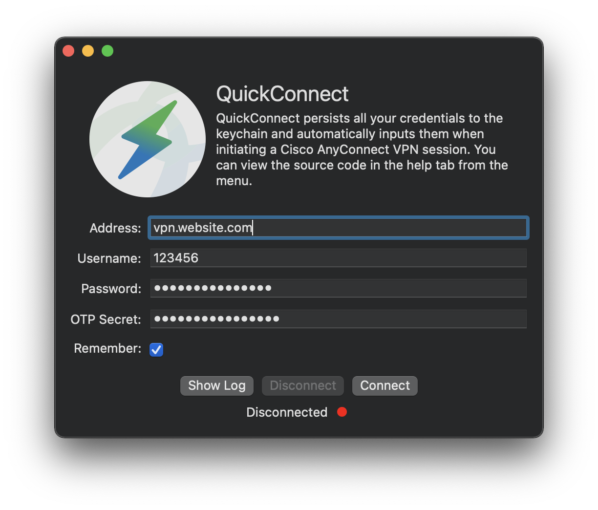
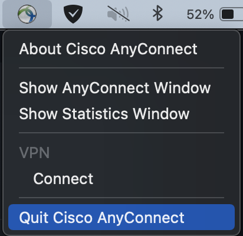

  
   
   
	
   
  <h1>QuickConnect</h1>
  

    QuickConnect persists all your credentials to the keychain and automatically inputs them when initiating a Cisco AnyConnect Secure Mobility Client VPN session.
  

## Screenshot

## Troubleshooting

- Check the logs (**Show Log** button).

- Ensure **Cisco AnyConnect Secure Mobility Client** is installed

- Ensure `/opt/cisco/anyconnect/bin/vpn` exists

- A connection can't be made if **Cisco AnyConnect Secure Mobility Client.app** is already running. Close it from the menu bar.

  

## Installation

1. Clone the project

2. Run the project with target **My Mac**

   
